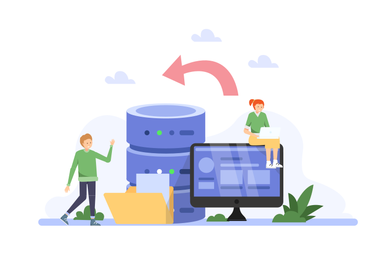

# Welcome to Nitrite Database

**NO**sql **O**bject (**NO2** a.k.a Nitrite) is a serverless, embedded, and self-contained NoSQL database. It is an open-source project that provides a simple API for persistent data storage. Nitrite database is designed to be lightweight, fast, and easy to use. Currently, it is available in Java, Kotlin, and Flutter.

Nitrite database can be used in various scenarios where a lightweight, embedded, and serverless NoSQL database is required. Some of the use cases for Nitrite database are:

- Mobile and desktop applications
- IoT devices and sensors
- Web applications and APIs
- Prototyping and testing
- Data caching and synchronization
- Data analysis and reporting

Nitrite database is designed to be simple and easy to use, making it a good choice for small to medium-sized projects that require a fast and reliable data storage solution.

## ✨ Features

- Embedded, serverless
- Simple API
- Document-oriented
- Schemaless document collection and object repository
- Extensible storage engines
- Indexing and full-text search
- Simple query api
- In-memory and file-based store
- Transaction support
- Schema migration support
- Encryption support

## ⛔ What Nitrite is not

Nitrite is not an RDBMS. It is also not a distributed NoSQL database like MongoDB or Cassandra. It does not have any server for external application to connect to.

## 🚀 Getting Started

Nitrite database is currently available in Java, Kotlin, and Flutter. Please visit respective language page for getting started guide.

- [Java](/java-sdk/getting-started)
- [Kotlin](/kotlin-sdk/getting-started)
- [Flutter](/flutter-sdk/getting-started)

## 📝 License

Nitrite database is an open-source project released under the terms of the [Apache License, Version 2.0](https://www.apache.org/licenses/LICENSE-2.0.html).

## 🤝 Support

Give a ⭐️ if this project helped you! Please consider [donating](https://github.com/sponsors/anidotnet) to support the development and maintenance.

## 💚 Contributing

Contributions, issues and feature requests are welcome! Feel free to open a discussion thread [here](https://github.com/orgs/nitrite/discussions).

## 🎞️ Showcase

If you are using Nitrite database in your project, please let us know. We will be happy to showcase your project [here](/showcase).
